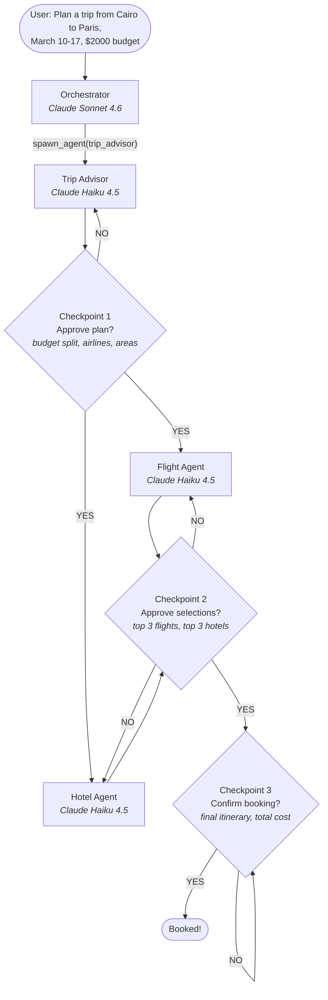

# Travel Planner

A multi-agent travel planning system built with LangGraph and LangChain. LLMs are **OpenAI** or **Anthropic** only (see configuration below).

One orchestrator agent coordinates three specialized sub-agents (Trip Advisor, Flight Agent, Hotel Agent) through a checkpoint-driven approval flow. The user stays in control at every decision point.

## How It Works



## Key Design Decisions

- **Single `spawn_agent` tool** -- The orchestrator has one generic tool that spawns any sub-agent by ID. Agent definitions (model, tools, timeout) live in YAML front matter in Markdown files. Adding a new agent = creating one `.md` file.

- **Context firewall** -- Each sub-agent receives only what it needs. The flight agent sees the flight budget slice ($700), never the total budget ($2000). No agent sees the conversation history or other agents' results.

- **Snapshot + tail compaction** -- Full conversation is persisted to `conversation.json`. When context usage exceeds 30% of the context window, an LLM generates a 9-section structured summary. The orchestrator then loads only the latest snapshot + recent messages.

- **Human-in-the-loop** -- Three mandatory checkpoints. The user can approve, reject (with constraints that accumulate across retries), or cancel at each one.

- **2-node ReAct loop** -- The LangGraph graph has just two nodes (`orchestrate` and `tool_node`) in a loop. All pipeline stage management, routing, and rejection handling lives in the orchestrator's system prompt rather than as graph nodes.

## Project Structure

```
src/travel_planner/
  graph.py                        # LangGraph StateGraph (2-node ReAct loop)
  state.py                        # TravelPlannerState schema

  agents/
    registry.py                   # Load agent defs from front matter MD
    runner.py                     # spawn_agent tool implementation

  orchestrator/
    nodes.py                      # orchestrate_node, tool_node, should_continue

  context/
    snapshots.py                  # LLM-driven compaction (30% threshold)

  session/
    checkpointer.py               # Custom LangGraph checkpointer
    manager.py                    # Session lifecycle
    persistence.py                # JSON file I/O
    entries.py                    # Conversation entry builders

  skills/
    loader.py                     # load_skill tool (progressive capability loading)

  tools/
    search.py                     # web_search, destination_lookup, search_flights, search_hotels
    compare.py                    # compare_flights, compare_hotels
    booking.py                    # book_flight, book_hotel
    budget.py                     # budget_calculator

  prompts/
    orchestrator.system.md        # Orchestrator system prompt
    conversation_compaction.prompt.md
    agents/                       # Sub-agent definitions (front matter + prompt)
      trip_advisor.md
      flight_agent.md
      hotel_agent.md
    skills/
      booking.md                  # Booking skill (loaded on demand in Stage 3)

  mock_data/                      # Fake data (5 cities, flights, hotels)
    destinations.json
    flights.json
    hotels.json
    web_results.json
    budget_reference.json
```

## Setup

```bash
# Install
pip install -e ".[dev]"

# Configure
cp .env.example .env
```

Environment variables (see `.env.example`):

| Variable | Purpose |
|----------|---------|
| `ANTHROPIC_API_KEY` | Required when any model uses the `anthropic:` provider |
| `OPENAI_API_KEY` | Required when any model uses the `openai:` provider |
| `MAIN_MODEL` | Orchestrator chat model, format `provider:model_name` |
| `SUB_MODEL` | Sub-agents and utility calls, same format |
| `LANGCHAIN_TRACING_V2`, `LANGCHAIN_API_KEY`, `LANGCHAIN_PROJECT` | Optional LangSmith tracing |

**Supported LLM providers:** only **OpenAI** and **Anthropic**. Each value must look like `openai:gpt-4o` or `anthropic:claude-sonnet-4-6`. Defaults in `.env.example` use Anthropic; set `OPENAI_API_KEY` and point `MAIN_MODEL` / `SUB_MODEL` at `openai:…` to use OpenAI. Sub-agent prompts can also set `model:` in YAML front matter using the same `provider:model_name` strings.

```bash
# Run
langgraph dev
```

This starts a local server. Open LangGraph Studio for visual debugging or connect Agent Chat UI for conversation.

## Tech Stack

| Layer | Technology |
|-------|-----------|
| Graph engine | LangGraph |
| LLM abstractions | LangChain |
| LLM providers | **OpenAI** and **Anthropic** (`MAIN_MODEL` / `SUB_MODEL`, default Anthropic Claude) |
| Session persistence | Custom JSON files |
| Observability | LangSmith |
| Visual debugging | LangGraph Studio |

## Documentation

See **[docs/](docs/INDEX.md)** for detailed technical documentation:

1. **[Architecture](docs/ARCHITECTURE.md)** -- System topology, 2-node ReAct graph, state schema, project structure
2. **[Agents](docs/AGENTS.md)** -- All 4 agents, registry pattern, tools, input/output contracts
3. **[Orchestration Flow](docs/ORCHESTRATION_FLOW.md)** -- 3-stage pipeline, checkpoints, rejection handling, progressive skill loading
4. **[Context Engineering](docs/CONTEXT_ENGINEERING.md)** -- Per-agent filtering, snapshot + tail compaction, context firewall
5. **[Session Management](docs/SESSION_MANAGEMENT.md)** -- Session lifecycle, file structure, conversation entries, custom checkpointer
6. **[Tools and Mock Data](docs/TOOLS_AND_MOCK_DATA.md)** -- All 9 tools, mock data fixtures, data loaders

## QA Test Cases

**[docs/test_cases/](docs/test_cases/INDEX.md)** contains conversation-level test cases for the QA team. Each test case specifies exact user messages and the expected assistant response criteria (what must and must not appear), grounded in the mock data.

| Test Case | Scenario |
|-----------|----------|
| [TC001](docs/test_cases/TC001_happy_path_paris.md) | Happy path — Cairo → Paris, mid-range budget, full booking flow |
| [TC002](docs/test_cases/TC002_happy_path_bali.md) | Happy path — Cairo → Bali, budget travel, full booking flow |
| [TC003](docs/test_cases/TC003_plan_rejection.md) | Plan rejection — user requests a different budget split, plan re-runs with new constraints |
| [TC004](docs/test_cases/TC004_flight_rejection.md) | Flight-only rejection — hotel locked, flight re-runs with accumulated constraints |
| [TC005](docs/test_cases/TC005_hotel_rejection.md) | Hotel-only rejection — flight locked, hotel re-runs with accumulated constraints |
| [TC006](docs/test_cases/TC006_both_rejected.md) | Both rejected — separate constraints applied per agent on re-run |
| [TC007](docs/test_cases/TC007_triple_rejection_escalation.md) | Triple rejection escalation — system proposes upstream changes after 3 failed retries |
| [TC008](docs/test_cases/TC008_booking_cancellation.md) | Booking cancellation — user cancels at final confirmation, no booking fires |
| [TC009](docs/test_cases/TC009_clarifying_questions.md) | Incomplete input — orchestrator asks targeted clarifying questions before planning |
