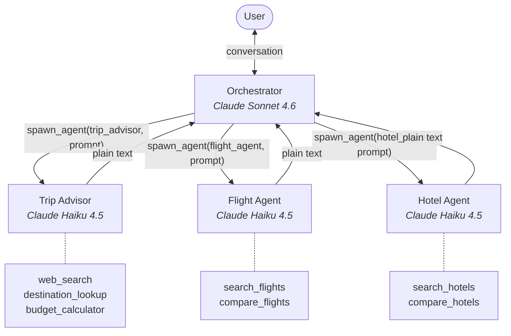
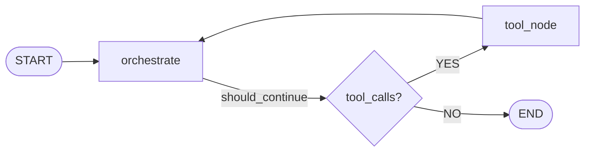

# Architecture

## System Topology

The system uses an **orchestrator-delegates** pattern. A single orchestrator agent manages a 3-stage travel planning pipeline by spawning three specialized sub-agents on demand.



**Key properties:**

- **One orchestrator, three sub-agents.** The orchestrator (Sonnet) handles conversation, routing, and booking. Sub-agents (Haiku) handle research and selection.
- **No direct agent-to-agent communication.** All coordination passes through the orchestrator. Sub-agents never see each other's output.
- **Sub-agents are ephemeral.** Each `spawn_agent` call creates a fresh `create_react_agent()` instance. It runs its tool loop, returns plain text, and is destroyed.
- **Plain text communication.** The orchestrator sends a filtered natural-language prompt to each sub-agent. Sub-agents return natural-language responses. No structured schemas between agents.

## LangGraph Graph

The graph is a standard **2-node ReAct loop** defined in `src/travel_planner/graph.py`:



```python
def build_graph() -> StateGraph:
    builder = StateGraph(TravelPlannerState)

    builder.add_node("orchestrate", orchestrate_node)
    builder.add_node("tools", tool_node)

    builder.add_edge(START, "orchestrate")
    builder.add_conditional_edges(
        "orchestrate",
        should_continue,
        {"tools": "tools", END: END},
    )
    builder.add_edge("tools", "orchestrate")

    return builder

graph = build_graph().compile()
```

**`orchestrate` node** (`orchestrator/nodes.py: orchestrate_node`): Manages the session, checks for context compaction, builds the message list (with snapshot if applicable), calls the LLM with tools bound, and persists the response.

**`tool_node`** (`orchestrator/nodes.py: tool_node`): Executes all tool calls from the LLM response using LangGraph's `ToolNode`. Tools available: `spawn_agent`, `load_skill`, `book_flight`, `book_hotel`.

**`should_continue`** (`orchestrator/nodes.py`): Routes to `"tools"` if the last message has tool calls, otherwise routes to `END`.

### Why 2 Nodes Instead of Many

All pipeline stage management (planning, selection, booking), checkpoint enforcement, rejection handling, context filtering, and coherence validation live in the **orchestrator's system prompt**, not as graph nodes or code-level routing. This makes the graph trivial and the system prompt the primary control surface.

## State Schema

Defined in `src/travel_planner/state.py`:

```python
class TravelPlannerState(TypedDict):
    messages: Annotated[list[BaseMessage], add_messages]
    session_id: str
    last_snapshot_id: Optional[int]
    last_snapshot_entry_count: Optional[int]
    last_snapshot_message_count: Optional[int]
```

The state is intentionally minimal. All domain data (travel plan, flight selections, hotel selections, booking confirmations) lives in the message history rather than as explicit state fields. The snapshot fields track compaction state for the snapshot + tail pattern.

## Entry Point

Configured in `langgraph.json`:

```json
{
  "dependencies": ["."],
  "graphs": {
    "travel_planner": "./src/travel_planner/graph.py:graph"
  },
  "env": ".env"
}
```

Run with `langgraph dev`, which starts a local server with the Agent Chat UI.

## Tech Stack

| Component | Technology | Version |
|-----------|-----------|---------|
| Language | Python | >= 3.11 |
| Graph engine | LangGraph | >= 0.4 |
| LLM abstractions | LangChain | >= 0.3 |
| LLM provider | langchain-anthropic | >= 0.3 |
| Observability | LangSmith | >= 0.2 |
| Config parsing | PyYAML | >= 6.0 |
| Dev server | langgraph-cli | >= 0.2 |

## Project Structure

```
src/travel_planner/
  __init__.py                     # Package, version 0.1.0
  graph.py                        # LangGraph StateGraph (2-node ReAct loop)
  state.py                        # TravelPlannerState TypedDict

  orchestrator/
    nodes.py                      # orchestrate_node, tool_node, should_continue

  agents/
    registry.py                   # Load agent definitions from front matter MD
    runner.py                     # spawn_agent tool

  context/
    snapshots.py                  # Snapshot + tail compaction

  session/
    checkpointer.py               # SessionCheckpointer (LangGraph BaseCheckpointSaver)
    manager.py                    # create_session, resume_session, complete_session
    persistence.py                # JSON/MD file I/O
    entries.py                    # Conversation entry builders

  skills/
    loader.py                     # load_skill tool

  tools/
    __init__.py                   # TOOL_REGISTRY dict
    search.py                     # web_search, destination_lookup, search_flights, search_hotels
    compare.py                    # compare_flights, compare_hotels
    booking.py                    # book_flight, book_hotel
    budget.py                     # budget_calculator

  prompts/
    orchestrator.system.md        # Orchestrator system prompt
    conversation_compaction.prompt.md  # Compaction LLM system prompt
    conversation_summary.template.md   # Summary template
    agents/
      trip_advisor.md             # Trip advisor definition
      flight_agent.md             # Flight agent definition
      hotel_agent.md              # Hotel agent definition
    skills/
      booking.md                  # Booking skill prompt

  mock_data/
    __init__.py                   # Data loaders with caching
    destinations.json             # 5 city profiles
    flights.json                  # Flight listings
    hotels.json                   # Hotel listings
    web_results.json              # Web search snippets
    budget_reference.json         # Cost tiers and budget splits
```
