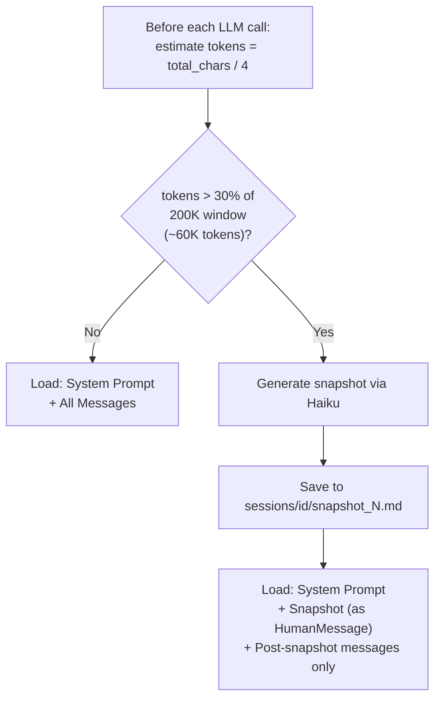
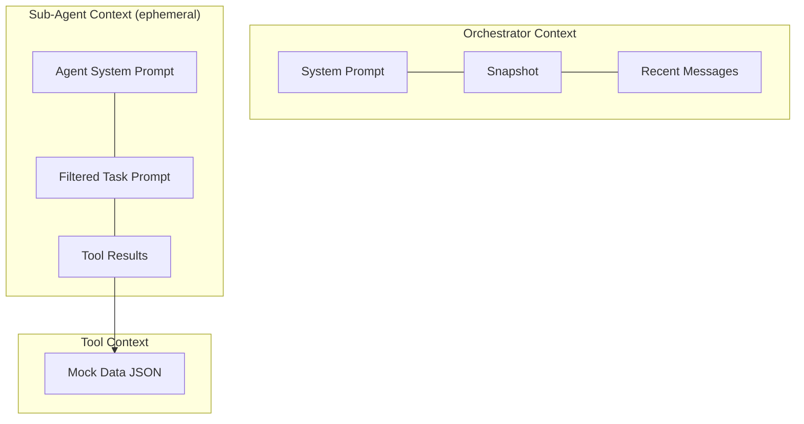

# Context Engineering

Context engineering is the discipline of controlling what information each agent sees. This system applies it at three levels: per-agent filtering, orchestrator compaction, and ephemeral sub-agent isolation.

## Per-Agent Context Filtering

The orchestrator constructs a **filtered plain-text prompt** for each `spawn_agent` call. Each agent receives only the fields relevant to its task.

### What Each Agent Sees

| Field | Trip Advisor | Flight Agent | Hotel Agent |
|-------|:-----------:|:------------:|:-----------:|
| Origin city | yes | yes | -- |
| Destination city | yes | yes | yes |
| Travel dates | yes | yes (as flight dates) | yes (as check-in/out) |
| **Total budget** | **yes** | -- | -- |
| Flight budget slice | -- | **yes** | -- |
| Hotel budget slice | -- | -- | **yes** |
| User preferences | yes | -- | -- |
| Preferred airlines | -- | yes | -- |
| Preferred flight times | -- | yes | -- |
| Preferred hotel areas | -- | -- | yes |
| Guest arrival info | -- | -- | yes (optional) |
| Rejection constraints | yes | yes | yes |
| Conversation history | -- | -- | -- |
| Other agents' results | -- | -- | -- |
| Snapshot content | -- | -- | -- |

### Context Firewall

The filtering rules are enforced by the orchestrator's system prompt, which explicitly lists what to include and exclude for each agent type. Key isolation properties:

- **Budget slicing**: The flight agent sees only the flight allocation (e.g., $700), never the total budget ($2000). Same for the hotel agent. This prevents agents from reasoning about budget they don't control and eliminates overspend across categories.
- **No cross-agent data**: The hotel agent never sees flight results. The flight agent never sees hotel results. The trip advisor never sees either. This prevents cross-agent hallucination.
- **No conversation history**: Sub-agents receive only their task prompt. They never see the user's conversation with the orchestrator, prior agent outputs, or internal state.

### How Filtering Works

There are no dedicated filtering functions in the codebase (no `build_flight_input()`, etc.). The orchestrator LLM constructs each agent's prompt based on instructions in its system prompt. The relevant section of the orchestrator prompt specifies:

- **For trip_advisor**: Include origin, destination, dates, total budget, preferences, rejection constraints
- **For flight_agent**: Include origin, destination, dates, flight budget slice, preferred airlines, preferred times, rejection constraints. Do NOT include total budget, hotel data, or conversation history
- **For hotel_agent**: Include city, check-in/out dates, hotel budget slice, preferred areas, guest arrival info, rejection constraints. Do NOT include total budget, flight data, or conversation history

## Snapshot + Tail Compaction

For the orchestrator's own context window, the system uses a **snapshot + tail** pattern to keep token usage bounded across long conversations with multiple rejections.

### How It Works



### Implementation

Located in `src/travel_planner/context/snapshots.py`:

1. **Token estimation**: `total_chars / 4` as a rough token count
2. **Threshold**: 30% of the model's context window (200K for Sonnet 4.6 = ~60K tokens)
3. **Snapshot generation**: Invokes Claude Haiku with the `conversation_compaction.prompt.md` system prompt, passing the full conversation as input
4. **Storage**: Written to `sessions/{session_id}/snapshot_{N}.md` as a standalone Markdown file
5. **State update**: Sets `last_snapshot_id`, `last_snapshot_entry_count`, and `last_snapshot_message_count` in the graph state

### Context Loading After Compaction

In `orchestrate_node`, message list construction depends on whether a snapshot exists:

**No snapshot (early conversation):**
```
[SystemMessage(orchestrator prompt)] + [all messages]
```

**After snapshot:**
```
[SystemMessage(orchestrator prompt)] + [HumanMessage(snapshot content)] + [messages after snapshot index]
```

The `last_snapshot_message_count` field tracks how many messages the snapshot covers. Only messages after that index are included in the tail.

### 9-Section Snapshot Format

The compaction LLM produces a structured summary with these sections:

1. **Primary Request and Intent** -- Destination, dates, budget, travelers
2. **Key Decisions and Concepts** -- What was approved, rejected, chosen
3. **Artifacts and Outputs** -- Plans, search results, rankings
4. **Corrections and Pivots** -- Rejections with reasons, constraint changes
5. **User Messages (Chronological)** -- Verbatim user intents preserving tone
6. **Resolved Questions** -- Settled items that don't need revisiting
7. **Pending Tasks** -- What remains to be done
8. **Current State** -- Which checkpoint was reached, current status
9. **Suggested Next Steps** -- Actionable for the orchestrator

The prompt (`prompts/conversation_compaction.prompt.md`) emphasizes:
- Completeness over brevity
- Preserving exact user phrasing for decisions and corrections
- Including rejected alternatives and why they were rejected
- Domain-precise language
- Recency weighting (recent context gets more detail)

## Ephemeral Sub-Agent Isolation

Sub-agents have the strongest form of context isolation: they are **stateless and disposable**.

Each `spawn_agent` call in `agents/runner.py`:
1. Creates a new `create_react_agent()` instance with its own model, tools, and system prompt
2. Passes the orchestrator's filtered prompt as a single `HumanMessage`
3. The agent runs its tool loop (up to `max_tool_calls`)
4. Returns its final response as plain text
5. The agent instance is garbage collected

There is no state carryover between invocations of the same agent type. If the flight agent is called twice (e.g., after a rejection), the second call has no memory of the first. Any context it needs (including rejection constraints) must be explicitly included in the prompt by the orchestrator.

## Summary of Context Boundaries



Each layer sees less than the one above it:
- **Orchestrator**: Full conversation context (compacted via snapshots)
- **Sub-agents**: Single filtered prompt + their own tool results
- **Tools**: Only the query parameters passed to them, accessing only relevant mock data
