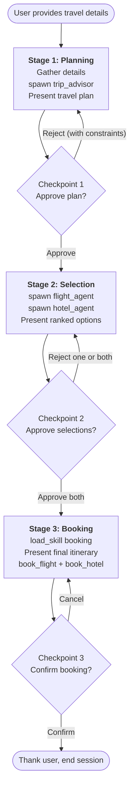
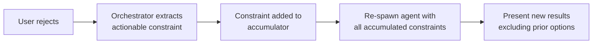

# Orchestration Flow

The orchestrator drives a **3-stage pipeline** with human-in-the-loop checkpoints. All stage management, routing, and decision logic lives in the orchestrator's system prompt -- not as graph nodes or code-level conditionals.

## Pipeline Overview

## Stage 1: Planning

**Goal:** Research the destination and produce a travel plan with budget allocation.

1. The orchestrator gathers travel details from the user: origin, destination, dates, budget, preferences
2. Asks clarifying questions if needed (e.g., travel tier, specific interests)
3. Calls `spawn_agent("trip_advisor", prompt)` with a filtered prompt containing all user details
4. The trip advisor calls its tools (`destination_lookup`, `web_search`, `budget_calculator`) and returns a structured plan
5. The orchestrator presents the plan to the user: destination overview, budget split (flights / hotels / activities), recommended airlines, hotel areas

### Checkpoint 1: Approve Plan

The user can:
- **Approve**: Proceed to Stage 2
- **Reject with feedback**: e.g., "allocate more to hotels", "I prefer morning flights". The orchestrator extracts actionable constraints and re-spawns the trip advisor

## Stage 2: Selection

**Goal:** Find specific flight and hotel options within the approved budget split.

1. The orchestrator calls `spawn_agent("flight_agent", prompt)` with: route, dates, **flight budget slice**, preferred airlines/times, and any constraints
2. The orchestrator calls `spawn_agent("hotel_agent", prompt)` with: city, dates, **hotel budget slice**, preferred areas, arrival info, and any constraints
3. The orchestrator checks for coherence between results:
   - Late flight arrival vs. hotel check-in time
   - Combined cost vs. total budget
   - Return flight timing vs. hotel check-out
4. Presents ranked options (up to 3 from each agent) with a recommended pick

### Checkpoint 2: Approve Selections

The user can:
- **Approve both**: Proceed to Stage 3
- **Reject one**: The approved result is preserved. Only the rejected agent is re-spawned with accumulated constraints
- **Reject both**: Both agents are re-spawned with accumulated constraints

## Stage 3: Booking

**Goal:** Confirm and execute the booking.

1. The orchestrator calls `load_skill("booking")` to load the booking procedure prompt
2. Presents the complete itinerary: selected flight + hotel, total cost, remaining budget for activities
3. Asks for explicit confirmation before booking

### Checkpoint 3: Confirm Booking

The user can:
- **Confirm**: The orchestrator calls `book_flight` and `book_hotel` directly (these are orchestrator-level tools, not sub-agent tools)
- **Cancel**: Return to adjust selections

After booking, the orchestrator presents confirmation references and thanks the user.

## Rejection Handling

Rejections are a core part of the flow. The system handles them through constraint accumulation:

### Rules

- **Constraints accumulate.** Each rejection adds new constraints; previous constraints are never dropped. Example: rejection 1 adds "no flights over $600", rejection 2 adds "no layovers" -- the re-spawned agent sees both.
- **Only the rejected agent re-runs.** If the user approves flights but rejects hotels, only the hotel agent is re-spawned.
- **Rejected options are never shown again.** The orchestrator tracks what was previously rejected and instructs agents to exclude those options.
- **Escalation after 3 rejections.** If the same stage is rejected 3 times, the orchestrator suggests upstream changes: adjusting the budget, changing dates, or picking a different destination.

## Progressive Skill Loading

The orchestrator uses a **skills system** for progressive capability disclosure:

| Skill | Loaded when | Provides |
|-------|-------------|----------|
| `booking` | Stage 3 (before booking) | Detailed booking procedure: parallel tool calls, confirmation verification, summary format |

The `load_skill(skill_name)` tool reads a prompt file from `prompts/skills/{name}.md` and returns it as text. The LLM then follows the skill's instructions. This keeps the orchestrator's base system prompt focused on coordination, loading specialized procedures only when needed.

### Booking Skill Procedure

The booking skill prompt (`prompts/skills/booking.md`) instructs the orchestrator to:

1. Require explicit user confirmation before calling any booking tool
2. Call `book_flight` and `book_hotel` (both are direct orchestrator tools)
3. Verify both confirmations return `status: "confirmed"`
4. Present a summary with booking references, total cost, and remaining budget for activities
5. Report errors if either booking fails
