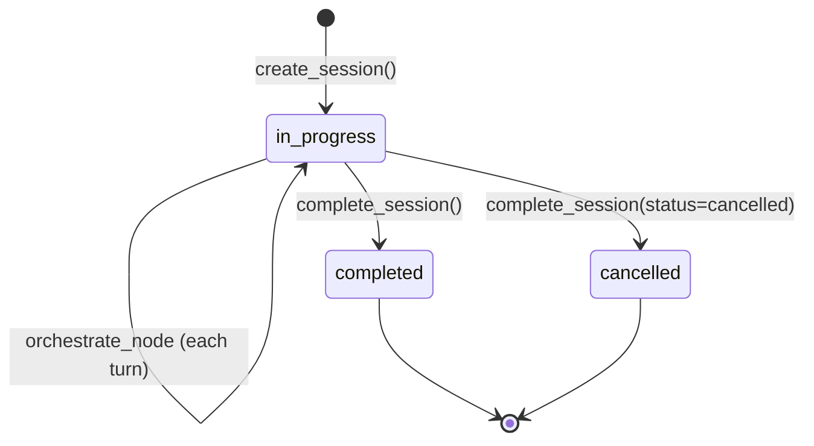
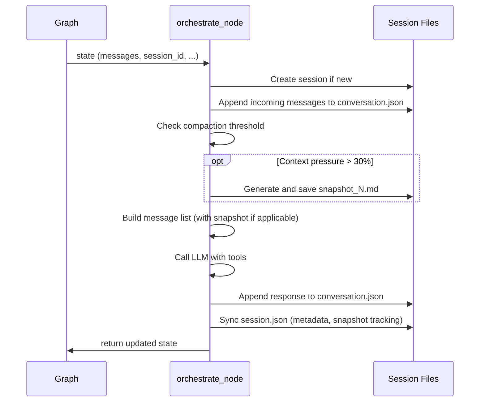

# Session Management

Each conversation gets a persistent session with a unique ID. Session data is stored as JSON and Markdown files on disk.

## Session Lifecycle

Managed by `src/travel_planner/session/manager.py`:



### `create_session()`

Called on the first invocation when `state["session_id"]` is empty:
- Generates a UUID
- Creates the session directory under `sessions/{uuid}/`
- Writes initial `session.json` with metadata
- Returns the session ID

### `resume_session(session_id)`

Called on subsequent invocations:
- Loads `session.json` for metadata and snapshot tracking
- Returns session state for the orchestrate node to use

### `complete_session(session_id, status)`

Called when the booking is complete or the user cancels:
- Updates `session.json` with final status and timestamp

## File Structure

```
sessions/
  {uuid}/
    session.json           # Session metadata
    conversation.json      # Append-only entry log (source of truth)
    checkpoint.json        # LangGraph checkpoint data
    snapshot_1.md          # First compaction snapshot (if generated)
    snapshot_2.md          # Second snapshot (if needed)
    ...
```

### `session.json`

```json
{
  "id": "uuid",
  "created_at": "2026-03-28T10:00:00Z",
  "updated_at": "2026-03-28T10:05:00Z",
  "status": "in_progress",
  "models": {
    "orchestrator": "claude-sonnet-4-6",
    "sub_agents": "claude-haiku-4-5"
  },
  "last_snapshot_id": 1,
  "last_snapshot_entry_count": 45,
  "last_snapshot_message_count": 50,
  "conversation_entries": 120
}
```

Updated by `_sync_session_file()` in `orchestrator/nodes.py` after each orchestration turn.

### `conversation.json`

An append-only array of conversation entries. This is the **source of truth** for the full conversation history. Each entry is a dict with a `type` field.

### `snapshot_{N}.md`

Standalone Markdown files containing 9-section structured summaries generated by the compaction LLM. Numbered sequentially starting from 1.

### `checkpoint.json`

LangGraph's checkpoint data, written by the custom `SessionCheckpointer`.

## Conversation Entries

Defined in `src/travel_planner/session/entries.py`. Each entry builder returns a dict with a `type` field and a `timestamp`.

### Entry Types

**`message`** -- User or assistant text:
```json
{
  "type": "message",
  "role": "user",
  "content": "Plan a trip from Cairo to Paris, March 10-17, $2000 budget",
  "timestamp": "2026-03-28T10:00:00Z"
}
```

**`tool_call`** -- Sub-agent invocation:
```json
{
  "type": "tool_call",
  "agent": "trip_advisor",
  "prompt": "Research Paris as a travel destination...",
  "timestamp": "2026-03-28T10:00:01Z"
}
```

**`tool_result`** -- Sub-agent response:
```json
{
  "type": "tool_result",
  "agent": "trip_advisor",
  "response": "## Travel Plan for Paris\n\n...",
  "timestamp": "2026-03-28T10:00:05Z"
}
```

**`checkpoint`** -- User approval decision:
```json
{
  "type": "checkpoint",
  "checkpoint": 1,
  "label": "travel_plan_approved",
  "approved": { "budget_split": { "flights": 700, "hotels": 900, "activities": 400 } },
  "timestamp": "2026-03-28T10:01:00Z"
}
```

**`snapshot`** -- Compaction summary:
```json
{
  "type": "snapshot",
  "snapshot_id": 1,
  "summary": "## 1. Primary Request and Intent\n\n...",
  "timestamp": "2026-03-28T10:02:00Z"
}
```

## Persistence Layer

File I/O is handled by `src/travel_planner/session/persistence.py`:

- **`load_conversation(session_dir)`**: Reads `conversation.json`, returns list of entry dicts
- **`append_entries(session_dir, entries)`**: Appends new entries to `conversation.json`
- **`save_session(session_dir, metadata)`**: Writes `session.json`
- **`load_session(session_dir)`**: Reads `session.json`
- **`save_snapshot(session_dir, snapshot_id, content)`**: Writes `snapshot_{N}.md`
- **`load_snapshot(session_dir, snapshot_id)`**: Reads `snapshot_{N}.md`

## Custom LangGraph Checkpointer

`src/travel_planner/session/checkpointer.py` implements `SessionCheckpointer`, a custom `BaseCheckpointSaver` that bridges LangGraph's checkpoint mechanism to the session file structure.

LangGraph expects a checkpointer to persist graph state between invocations. The default options (SQLite, Postgres) don't fit the session file layout, so `SessionCheckpointer` writes checkpoint data to `checkpoint.json` in the session directory alongside the other session files.

## How Persistence Flows Through orchestrate_node

Each call to `orchestrate_node` triggers this persistence sequence:


